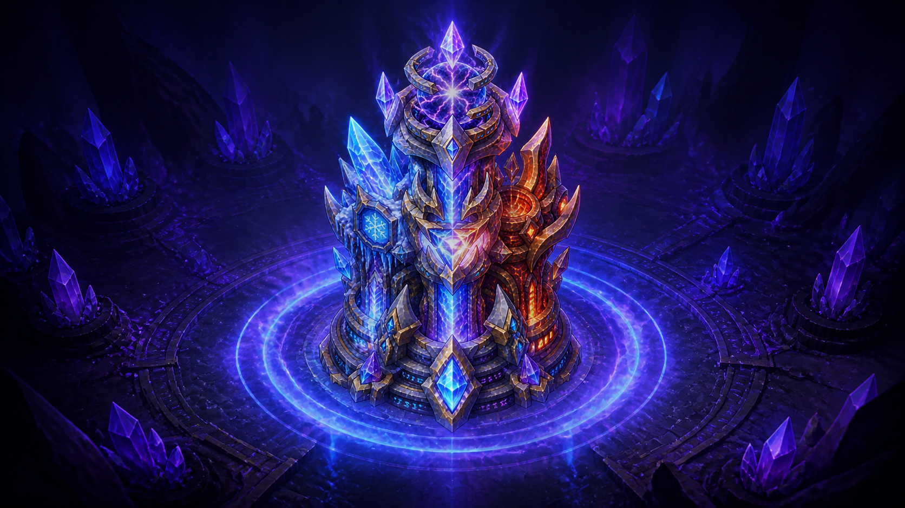
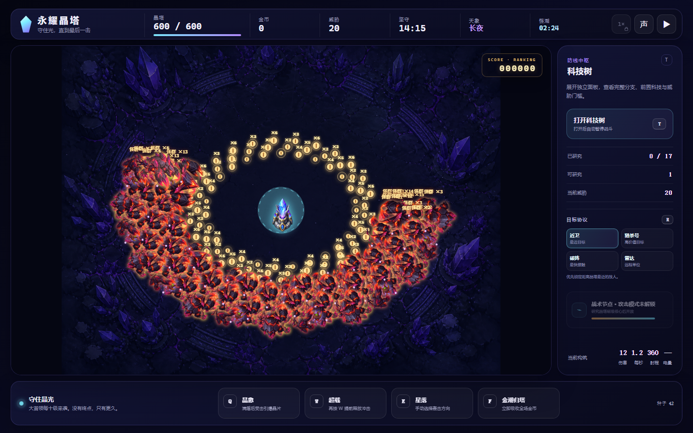
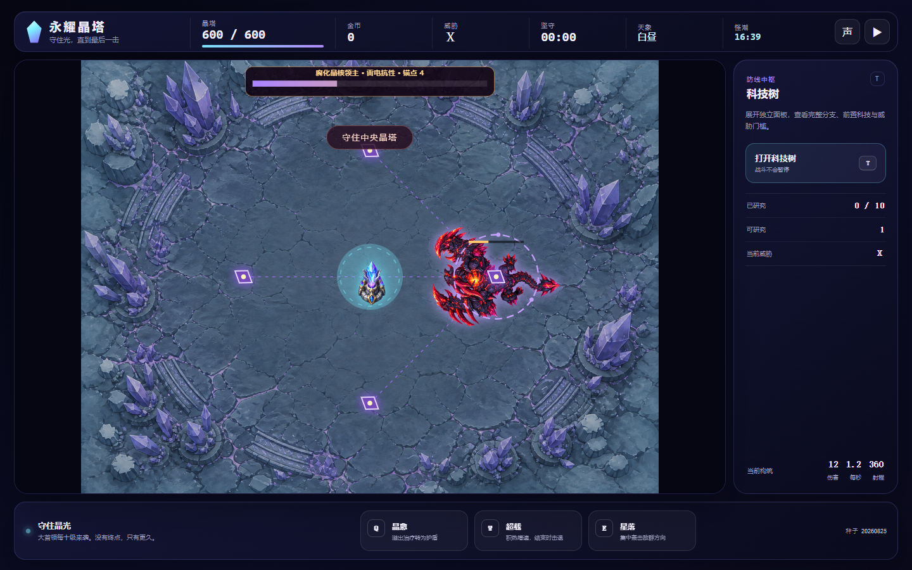
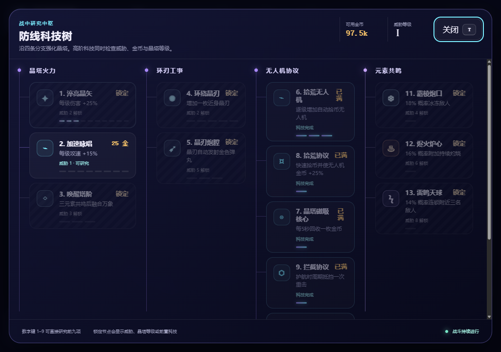
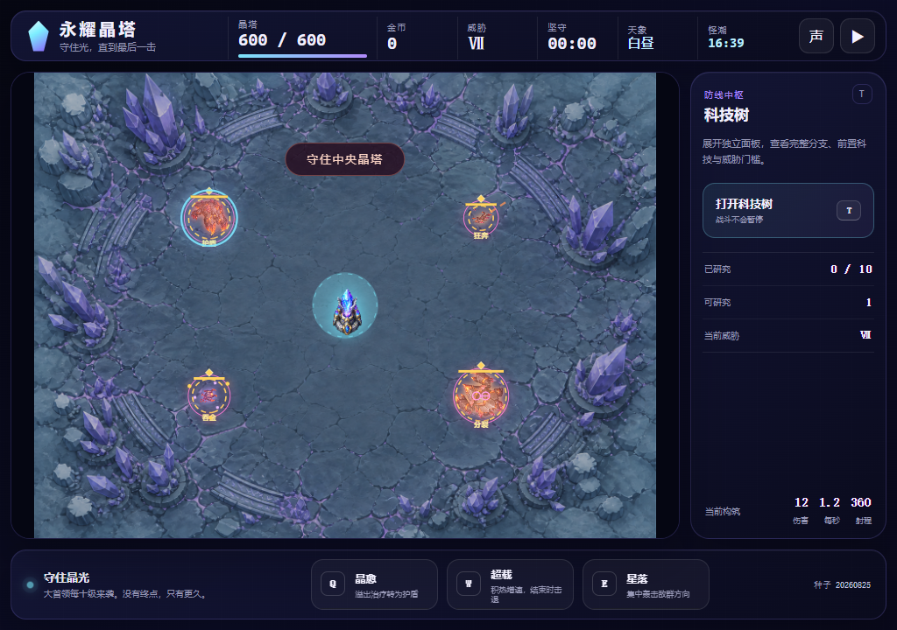
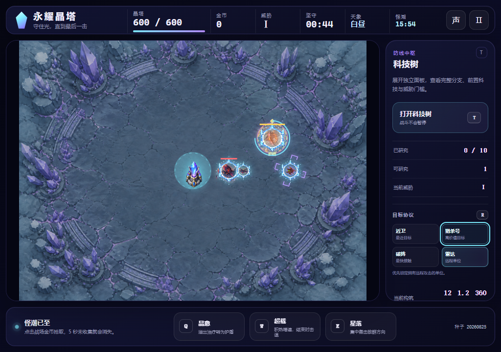
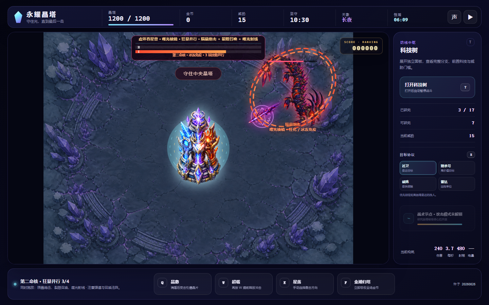

<p align="center">
  
</p>

<h1 align="center">永耀晶塔 ETERNAL CRYSTAL TOWER</h1>

<p align="center">
  <strong>守住光，直到最后一击。</strong><br />
  一款原生 Canvas 2D 塔防增量游戏，纯 HTML/CSS/JavaScript 打造，零后端依赖。
</p>

<p align="center">
  <a href="#快速开始">快速开始</a> ·
  <a href="#游戏截图">截图</a> ·
  <a href="#核心玩法">玩法</a> ·
  <a href="#科技树">科技树</a> ·
  <a href="#boss-战">Boss 战</a> ·
  <a href="#操作指南">操作</a> ·
  <a href="#技术实现">技术</a>
</p>

---

## 游戏截图

<table>
  <tr>
    <td align="center"><strong>怪潮围攻</strong></td>
    <td align="center"><strong>首领对决</strong></td>
    <td align="center"><strong>科技面板</strong></td>
  </tr>
  <tr>
    <td></td>
    <td></td>
    <td></td>
  </tr>
  <tr>
    <td align="center"><strong>精英词缀</strong></td>
    <td align="center"><strong>目标协议</strong></td>
    <td align="center"><strong>威胁 XV 巨兽狂暴</strong></td>
  </tr>
  <tr>
    <td></td>
    <td></td>
    <td></td>
  </tr>
</table>

---

## 快速开始

需要 **Node.js 18+**。

```bash
npm start
```

浏览器打开 [http://127.0.0.1:4173](http://127.0.0.1:4173)。

### 可复现种子

通过 URL 参数指定种子，可完整复现同一局战斗：

```
?seed=20260824
```

### 预览模式


| 参数                                    | 用途                     |
| --------------------------------------- | ------------------------ |
| `?preview=loading`                      | 固定显示素材加载界面     |
| `?preview=tutorial-coin`                | 检查首局引导 — 金币回收 |
| `?preview=tutorial-upgrade`             | 检查首局引导 — 科技研究 |
| `?preview=tutorial-branches`            | 检查首局引导 — 分支选择 |
| `?preview=leaderboard-messages&seed=42` | 查看排行榜留言气泡       |
| `?preview=tower-health&seed=744`        | 查看塔体血条与护盾效果   |
| `?preview=resources`                    | 遗响碎片与核心残片收集   |
| `?preview=recovery`                     | 首次失败核心残响事件     |
| `?preview=basecamp`                     | 大本营核心室             |
| `?preview=relics&seed=42`               | 临时遗物三选一界面       |
| `?preview=endless-shop`                 | 威胁 25 裂隙行商商店     |

---

## 核心玩法

**永耀晶塔**是一款原生 Canvas 2D 塔防增量游戏原型。晶塔固定在战场中央并自动射击，玩家通过鼠标滑过或点击回收金币、沿四分支科技树建立自动化防线、释放主动技能，并用阵亡所得星尘强化下一局。

### 两层循环


| 尺度          | 循环                                                           |
| ------------- | -------------------------------------------------------------- |
| **5–30 秒**  | 塔自动击杀 → 回收金币 → 研究科技或释放技能 → 战场立刻变化   |
| **1–5 分钟** | 威胁升级 → 新敌人加入 → 调整构筑 → 首领检验 → 获得生存窗口 |

### 体验支柱

- **中央孤塔** — 威胁从四周收紧，视线始终回到发光晶塔
- **压力中成长** — 每次购买立刻改变弹道、击杀速度或安全半径
- **绝地救场** — 技能在塔濒危时清场、提速或回血
- **死亡仍前进** — 阵亡所得星尘能让下一局明显更强

### 敌人体系

- **11 种普通敌人** — 从慢速幽灵到重装冲撞兽，逐步解锁
- **精英怪** — 每次怪潮固定混入一只，拥有 3.2 倍生命、1.45 倍伤害，携带四种词缀之一：护盾、狂奔、吞金、分裂
- **威胁 10 大首领** — 三阶段生命切换，四枚腐化锚点提供反制窗口
- **威胁 15 虚环吞星兽** — 双命核狂暴，椭圆轨道环行，四项灾厄技能轮换
- **威胁 20 裂界魔君** — 四管命核，降临护盾，终末狂暴并行施法

---

## 科技树

战斗中按 `T` 打开科技树面板，沿四条分支强化晶塔：


| 分支           | 核心科技                                              |
| -------------- | ----------------------------------------------------- |
| **晶塔火力**   | 淬亮晶矢、加速咏唱、唤醒塔阶、炮膛二选一（破城/裂晶） |
| **环刃工事**   | 环绕晶刃、疾旋炮刃 / 弹射飞刃互斥专精                 |
| **无人机协议** | 拾荒无人机、磁吸核心、拦截协议、猎杀协议              |
| **元素共鸣**   | 霜棱炮口、烬火炉心、雷鸣天球，三元素可同时安装        |

### 炮膛二选一

威胁 5 且「淬亮晶矢」达到 3 级后解锁，两条路线互斥：

- **破城炮膛** — 蓄能叠加伤害、贯星穿透、弱点校准，偏向首领与精英
- **裂晶炮膛** — 命中分裂、碎片增殖、晶爆回响，偏向怪潮清场

### 万象晶塔

三种元素科技全部完成且威胁达到 8 后，唤醒最后一级塔阶——融合冰霜、火焰、雷电三元素，同时发射三枚晶矢，外观切换为一体化塔身。

---

## Boss 战

### 威胁 X：腐化晶棱领主

每十级出现的大首领，拥有三个生命阶段——冰霜、火焰、雷电抗性依次切换，当前抗性元素只承受 35% 伤害。

每阶段在战场四周生成四枚腐化锚点：


| 锚点             | 效果                              |
| ---------------- | --------------------------------- |
| 青色六角 · 护盾 | 首领只承受 45% 伤害               |
| 绿色十字 · 修复 | 每秒恢复 1.2% 最大生命            |
| 紫色三角 · 召唤 | 每 3.5 秒生成一只随阶段增强的小怪 |
| 橙色闪电 · 过载 | 首领攻击间隔缩短至 55%            |

点击锚点可将其锁定 5 秒，阶段切换会清除旧锁定并重建。

### 威胁 XV：虚环吞星兽

双命核巨型首领，登场时获得腐晶护盾。第一命核清空后进入狂暴——四项技能改用独立冷却并行施放，清除并免疫冰冻。第二命核清空才完成结算。

### 威胁 XX：裂界魔君

四管命核，65% 降临护盾。护盾击破后取消当前动作并锁定为一次召唤。进入最后一管命核即刻开启终末狂暴。

---

## 主动技能


| 按键 | 技能         | 效果                                                    |
| ---- | ------------ | ------------------------------------------------------- |
| `Q`  | **晶愈**     | 恢复 20% 最大生命，过量转化为护盾；护盾满后装填晶片反击 |
| `W`  | **超载**     | 6 秒内攻速翻倍；再按可提前释放环形击退，维持过久会过热  |
| `E`  | **星落**     | 手动瞄准扇区，造成 6 倍塔攻击力伤害；右键/Esc 取消      |
| `F`  | **金潮归塔** | 立即结算战场上全部金币，包括正在回收中的                |

---

## 操作指南

### 桌面端


| 操作              | 说明                                      |
| ----------------- | ----------------------------------------- |
| 鼠标滑过/点击金币 | 手动回收                                  |
| `1`–`9`          | 研究科技树前九个节点                      |
| `T`               | 打开/关闭科技树                           |
| `R`               | 循环切换目标协议（近卫/猎杀号/破阵/雷达） |
| `P` / `Esc`       | 暂停/继续                                 |
| `U`               | 打开/关闭更新公告                         |
| `X`               | 切换 1×/2× 时流倍率（需解锁）           |
| `M`               | 打开/关闭无尽模式裂隙行商（威胁 25 后） |

### 触屏

点击金币回收；点击「星落」后再点击战场方向释放。移动端自动扩大触控判定范围，适配刘海屏安全区。

### 目标协议

晶塔自动射击，玩家可通过协议切换攻击优先级：


| 协议   | 策略                   |
| ------ | ---------------------- |
| 近卫   | 优先最近目标，稳守塔下 |
| 猎杀号 | 优先首领、精英、咒晶怪 |
| 破阵   | 优先最快接触的敌人     |
| 雷达   | 优先远程攻击单位       |

---

## 每局临时遗物

每次怪潮精英、普通首领、巨兽阶段结束时弹出三选一卡片，选择时冻结战场。

新存档默认 1 个遗物槽，只解锁「棱镜护佑」。其余九件机制遗物需在研究舱使用遗响碎片永久解锁。遗物栏位使用核心残片扩展（2/4/7 枚），最多 4 格。

### 已知遗物

- **棱镜护佑** — 默认解锁
- **诡光诱饵** — 沿怪潮预告方向生成，摧毁后按塔伤爆炸
- **月相调律** — 白昼金币 +25%，长夜元素 +40%，昼夜切换获得 6 秒强化
- **镜面裂片** — 每 5 次普通齐射折射一次
- **余烬回收** — 只响应灼烧或爆炸击杀

数值强化可重复获得：攻击 +8%、攻速 +6%、双相攻击 +4% 且攻速 +3%。

---

## 永久成长与大本营

- **星尘** — 阵亡结算，用于永久研究（攻击/生命/金币收益各 30 级）
- **遗响碎片** — 精英掉落，用于研究舱解锁遗物
- **核心残片** — 首领掉落，用于扩展遗物栏位

首次阵亡解锁大本营核心室，包含晶核中枢和研究舱。永久资源以独立战场实体出现，需点击收集或磁吸核心自动吸收。

---

## 排行榜与云存档

- 全服共享排行榜，同一 Node.js 进程内所有玩家实时竞争
- 榜 1/2/3 使用晶体领奖台视觉，支持 10 字符留言气泡
- 游客无需登录，存档保留在当前浏览器
- 登录后云端存档与本地不冲突，玩家明确选择后自动同步

---

## 账号与安全

- 密码只保存 scrypt 哈希
- 使用 HttpOnly Cookie 自动保持登录
- 生产环境设置 `SESSION_SECURE=1` 启用安全 Cookie

---

## 技术实现

- **渲染** — 原生 Canvas 2D，零外部框架
- **模块** — JavaScript ES Modules
- **音频** — Web Audio API 程序化生成
- **存档** — LocalStorage + JSON 持久化
- **种子** — 确定性 RNG，同种子同输入必得相同结果
- **响应式** — 桌面端、手机竖屏、手机横屏自适应
- **兼容** — 最低 1024×720，推荐 1440×900

### 项目结构

```
eternal-crystal-tower/
├── assets/generated/    # 程序化生成的美术素材
├── build/               # 构建产物
├── data/                # 排行榜与账号数据
├── design/              # 设计文档
├── qa/                  # QA 截图与测试报告
├── scripts/             # 开发脚本（serve.js）
├── src/                 # 游戏源码
├── tests/               # 测试
├── index.html           # 入口页面
├── styles.css           # 主样式
└── package.json
```

---

## 测试

```bash
npm test
```

覆盖：策划数值、目标选择、科技门槛、炮膛二选一、贯星穿透/蓄能、晶矢分裂/增殖/晶爆、金币回收、晶刃疾旋/弹射互斥、弹射与恢复、技能、永久研究、存档容错、种子复现、十级首领、威胁十五巨型首领词条/预兆/狂化与十五分钟压力模拟。

### 压力模拟

```bash
npm run test:sim
```
