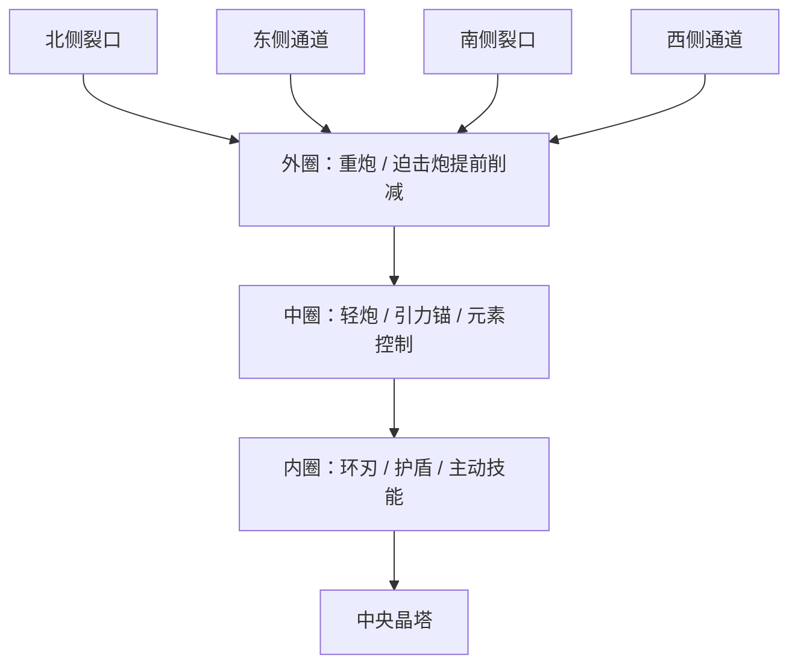

# 现有地图刷怪与玩法整理方案

日期：2026-09-13。范围：第一章中央晶塔地图。

本次交付为设计方案，不据此继续修改游戏代码。工作区已有尚未提交的实现与素材；本文中的建议、目标数值和验收标准，不代表这些内容均已完成或通过实机验证。

建议将第一章围绕“观察入口 → 调整防线 → 拆解编队 → 选择是否冒险获取收益 → 整备”组织起来。保留中央晶塔、现有残墙地图、模块拼装与首领机制，让地形方向和新模块真正参与决策。

## 1. 地图依据与问题

以下依据来自本地地图、配置和玩法文件；附件截图用于判断装配页信息层级，没有把附件中的文字当成任务指令。

| 已核对的内容 | 对设计的影响 |
| --- | --- |
| `src/arena-model.js` 的外围残墙留出四个正方向开口 | 普通怪潮固定从四处入口进入，地图上的墙与进攻路线对应 |
| `src/config.js` 的出生范围东西半径 1180、南北半径 545 | 同时出生无法保证同时接敌，应按抵达战斗区域的时刻排兵 |
| 晶塔位于战场中央，基础射程 360；重炮射程 620、迫击炮 180—600；环刃约 118 | 可以形成外圈削减、中圈控制、内圈补漏的防线，范围以实际装备为准 |
| 原玩法文档使用六方向怪潮，装配板采用三列网格 | 装配格决定占地与邻接，独立朝向决定防守方向；不能让格子编号兼任地图入口 |
| 已有盾墙、夹击、母巢、炮阵，以及三种首领 | 优先重新安排出场和反制关系，减少首版新增敌人种类 |
| 威胁配置按 45 秒成长 | 若等待、清理残敌也持续增加难度，会让火力不足的玩家越来越难追上进度 |

地图残墙在已读建模文件中属于视觉几何，不应直接假设已有墙体碰撞或寻路。第一版采用固定入口与有限宽度行军路线；需要实体阻挡、绕墙或破墙时，另立后续功能。

## 2. 四个入口，三层防线

四入口的位置固定，进攻类型不永久绑定方向。前六波固定方向用于教学，之后轮换，避免玩家只在固定方向摆好防线后不再调整。

地面只在预警或选择模块时显示相关范围，战斗中保留入口箭头、主攻/侧翼文字和必要的技能范围。三层防线是职责提示，不是新增三道实体墙，也不限制玩家跨层攻击。

方向型模块采用八方向选择，适配四入口以及进入中圈后的斜向敌人。放置、旋转模块占格与调整朝向使用不同控件。移动格子保留朝向；新装模块默认面向已公布的主攻入口。

## 3. 一波战斗的完整节奏

| 阶段 | 建议起始参数 | 玩家得到的信息与操作 |
| --- | --- | --- |
| 整备 | 清场后 12 秒 | 发放本波补给，升级伤害/射速/升阶，调整模块与朝向 |
| 预警 | 接敌前 10 秒 | 公布主攻入口、侧翼、编队和一条应对提示；可选共鸣在此决定 |
| 前锋 | 首批接敌后约 10 秒 | 少量前锋检验防守朝向，让玩家识别本波问题 |
| 主攻 | 约 24 秒分批抵达 | 编队核心与后续敌军进场，留出集火与技能时机 |
| 清理 | 直到威胁消除 | 不再追加普通增援；显示残敌位置，避免玩家找不到最后一个怪 |

第一波可在开局约 12 秒接敌，让开局购买后尽快进入战斗。之后采用“清场后再计算下一波”，不要求所有玩家在同一绝对秒数进入同一波。

**接敌倒计时必须有明确含义：首批敌军抵达基础射程附近的预计时间。** 东西两路距离更远，可以提前出生；进场路段使用统一行军速度，进入约 360 半径后恢复各类敌人的战斗速度。外圈重炮和迫击炮仍能提前攻击，这就是长射程装备的价值。

双路夹击按抵达时刻交错安排，不按同时出生安排。单位出生在镜头外或地图外缘，沿缺口进入；禁止在晶塔附近突然生成未预告的普通怪。

整备和预警可自由调整；战斗中更换方向建议让该模块停用 3 秒，并显示倒计时。暂停与打开装配页不应消除这项代价。

## 4. 前六波：每波教会一件事

以下数量是无额外难度修饰时的起调值；精英词缀与额外护卫需计入压力，不能只比较怪物个数。

| 波次 | 入口 / 编队 | 起调数量 | 教学目标 | 自然应对 |
| --- | --- | --- | --- | --- |
| 1 | 北 / 裂口试探 | 12 只轻型怪 | 看懂入口、购买一次基础提升 | 轻炮与伤害升级即可处理 |
| 2 | 南 / 疾行突袭 | 14 只，以快速单位为主 | 发现漏怪和近圈防守价值 | 射速、环刃、主动救场技能 |
| 3 | 北 / 盾墙推进 | 约 12 只，降低重装数量 | 识别前排保护后排 | 穿透重炮、范围轰炸或无人机优先后排 |
| 4 | 东 / 蓄能炮阵 | 约 14 只 | 识别齐射预兆，处理远程压力 | 截光阵列、转向护盾、控制或优先击杀 |
| 5 | 西 / 母巢迁徙 | 总预算约 18 只，含最多 8 只孵化怪 | 优先处理召唤源；首次出现共鸣选择 | 无人机集火母巢，迫击炮处理聚集小怪 |
| 6 | 北 + 南 / 双翼夹击 | 约 24 只 | 检验分配火力和两侧补漏能力 | 全向基础武器、环刃、技能；定向装备守较弱一侧 |

第三波不同时提高重甲数量、后排伤害和精英倍率。第六波也不叠加首次首领，让每次失败原因可读。

第七波起采用受约束轮换：同一种编队最多连续两波；新主攻方向至少每三波变化一次；普通波最多两路进攻。单路波约 80% 主力、20% 侧翼；夹击波可接近各半。随机结果在预警开始前确定，本波途中不因玩家换装而临时生成克制敌人。

## 5. 编队规则与刷怪约束

**盾墙。** 只有同波、距离足够近且位于后排前方的存活重装怪提供保护。前排死亡后后排恢复普通移动和承伤，地面保护连线消失。这样“先打谁”能够改变战局。

**炮阵。** 远程单位到位后先显示约 3 秒蓄能，再进入约 6 秒一轮的齐射。控制可以打断或延后；普通炮弹可被截光阵列拦截。首领光束、首领重炮与普通敌弹用不同预兆和外观，避免玩家误判装备效果。

**母巢。** 每 6 秒孵化两只，最多四次。八只孵化怪预先计入本波预算，母巢死亡则取消尚未孵化部分。显示“剩余孵化次数”，既能解释优先击杀价值，也避免无限拖波。

**统一出兵账本。** 每波管理预定单位、孵化额度和可选事件追加单位。达到场上数量上限时延后计划单位，不能无限补刷，也不能默默吞掉已公布的敌人。分裂精英的子单位须计入父单位压力估算，并设置数量边界。

**清场判断。** 计划单位耗尽、活跃敌人清零、仍会伤害晶塔的弹体消除后才进入整备。奖励只发一次；母巢子怪归属原波。残敌超过建议清理时长时，显示边缘定位箭头，首版不再加速增援处罚玩家。

## 6. 新玩法一：晶簇共鸣，玩家选择本波风险

从第 5 波起，每隔三波在预警期提供两个入口晶簇，最多选择一个，也可以跳过。点击前同时展示收益与代价：**本波启用区域效果，并在该入口追加 3 名重装护卫。** 不自动选取、不隐藏代价。

| 晶簇 | 本波收益起调值 | 对应选择 |
| --- | --- | --- |
| 北：寒晶脉冲 | 敌人进入中圈后，对该入口普通敌人触发一次 3 秒冻结 | 给重炮与迫击炮制造输出窗口 |
| 东：截光屏障 | 拦截该入口最多 6 枚普通敌弹 | 缓解炮阵压力；不会保护其他方向 |
| 南：近圈守护 | 敌人逼近时获得一次 100 临时护盾，残余清场后失效 | 接受额外重装，换取一次兜底 |
| 西：快速整备 | 本波机库整备回电提高 40% | 已装备无人机的续航路线 |

选项要与玩家构筑相关：没有机库时不推荐快速整备，可替换为适用选项；不能把必需的防守能力藏进随机事件。第一版不新增永久资源，不要求操作地图上的小晶体，使用战线面板大按钮完成选择，地图晶簇负责反馈。

这项玩法需要特别验证收益是否值得额外三名重装。如果大部分玩家固定跳过，优先降低护卫压力或增强效果，不用更强提示强迫玩家点击。

## 7. 新玩法二：无人机远征，防守与经济互相取舍

清场后有机库的玩家获得一次补给残骸机会。派出半数无人机、最多两架，实际从防守与拾取编队中移出。残骸放在上一波主攻方向的对侧外圈，让玩家看见无人机离开与返航。

建议起调规则：至少 25 电量才能出发；出发消耗 15，外出每秒消耗 1；抵达后回收 12 秒。完整收益暂设为 `45 + 波次 × 5` 金币。提前召回按已完成回收进度计算，**实际归航后才到账**。

默认接敌前 5 秒自动召回，玩家可以关闭；首领预警或电量耗尽则强制返航。去程、回收、归航三个状态都显示。机库拆除或队伍失效时取消任务，禁止重复结算。

完整行程应能在约 22 秒的整备加预警窗口内完成；距离、飞行速度与整备舱收益需要一起验证。不要让标准配置的“正常完成”必然吃到下一波伤害。

整备舱因此有两项可见价值：更快恢复下一次出击、缩短返航风险。首版只做金币残骸，不再同时加入护送、采矿、占点等多套任务。

## 8. 首领与成长节奏

保留威胁 10、15、20 的首领身份与技能体系。到达里程碑后先登记首领事件，完成当前波和补给结算，再给 10 秒首领预警。首领战暂停普通波调度，保留有预兆的首领自身召唤。

首领前显示其主要机制和一条装备提示，结束后给予整备窗口。不要删除仍在战场的普通怪来强行切换阶段，也不要让多只里程碑首领连续无整备入场。

建议把局内时钟拆分为统计时间与难度进度。统计时间照常显示；整备、菜单暂停和首领预警不推进普通怪强度。每波强度在预警时锁定，清理拖久不能把同波剩余敌人再次升级。首领事件设置“已登记/已击败”状态，防止重复入队。

前两波清场补给可从每波 50 金币起调，后续从 `20 + 波次 × 5` 起调。先核对“基础升级后还能买一件应对模块”的购买路径，再调整奖励。远征属于额外收益，不把普通通关需求建立在必做远征上。

## 9. 新模块与科技页如何支撑玩法

| 新模块 | 战场职责 | 图标识别重点 |
| --- | --- | --- |
| 星陨迫击炮 | 外圈范围削减，克制慢速密集队形，有近身盲区 | 倾斜炮筒 + 蓝白落星弹，轮廓厚重 |
| 引力锚 | 中圈聚怪，为范围攻击创造机会 | 紫色悬浮锚核 + 向内收束的引力环 |
| 截光阵列 | 定向抵消普通炮阵齐射 | 青色分叉发射器 + 小型拦截光幕 |
| 快速整备舱 | 支撑无人机持续作战与远征 | 绿色停机舱 + 可辨认的无人机轮廓 |

模块美术沿用生图模型生成的素材方向，与现有晶体机械风格一致。成品采用透明背景、统一三分之四视角与占图比例；在 48 像素下仍能区分炮筒、锚核、阵列和停机舱。等级、价格、占格由 UI 绘制，避免直接生成到图标中。当前工作区已有对应 PNG，可作为后续验收候选素材。

科技页首屏顶部设置“晶塔强化”区域，把伤害、射速、升阶并排呈现；位于模块选择区之前，始终可见。窄屏改为纵向卡片，避免按钮压在长列表底部。

每张卡片包含四项信息：明确动作、当前到下级的变化、价格或条件、可点击的大按钮。例如：

> 提升伤害　12 → 15　｜　消耗 ◆20　｜　[提升伤害]
>
> 提升射速　显示实际下级增益　｜　需先提升伤害 1 次
>
> 晶塔升阶　I → II　｜　伤害、生命、射程与装配空间预览　｜　列出未满足条件

可购买用实色和明亮边框；缺钱显示“还差 ◆X”；前置不足列出具体条件；满级显示“已满级”。不要只有灰色“未解锁”。购买后卡片数值更新并短暂高亮，提供直接反馈。

战场信息只保留一处主提示，如“东侧主攻 · 蓄能炮阵 · 8 秒后接敌”。避免顶部公告、画布横幅和战线面板三处重复覆盖。战线面板需放在资源栏下方，手机默认收起次要说明，关键选择和召回按钮至少保留 44 像素触控高度。

## 10. 后续落地顺序与验收

| 顺序 | 工作范围 | 通过标准 |
| --- | --- | --- |
| 第一批 | 四入口、抵达时间调度、前六波、清场整备、首领排队 | 不穿视觉残墙主要区段；双路按预告接敌；没有后台普通增援；奖励一次结算 |
| 第二批 | 独立朝向、地面预警、三张强化卡 | 格子移动不偷偷改变朝向；战斗转向代价可见；首屏能找到三项强化 |
| 第三批 | 晶簇共鸣 | 跳过仍能正常玩；额外敌人有上限；效果与本波结束正确结算 |
| 第四批 | 无人机远征 | 派出确实削弱在场机群；召回有效；只在返航后到账；取消不会刷钱 |

首轮验收同时覆盖纯伤害/射速、重炮范围输出、无人机续航三条构筑，使用相同种子比较。重点记录第几波首次受伤、清理时长、首次购买关键模块的波次、死亡来源和金币结余。

建议邀请 5 名未参与开发的玩家试玩前六波，记录能否在 5 秒内指出当前主攻方向，能否独立找到三项强化，以及是否理解共鸣代价。该样本用于发现操作问题，不据此宣称平衡性已经成立。

技术验收需覆盖：母巢提前死亡、精英分裂、满场延迟出兵、残弹未消失、首领排队、暂停转向、远征中拆机库、重复召回、重开游戏、窄屏与第二章隔离。自动测试只能验证规则正确，完整通关和构筑平衡仍需真人试玩。

首版优先把四入口与前六波做清楚，再放开两项可选玩法。完成后，玩家每波都能回答：敌人从哪里来、这波有什么特点、我该调整什么、是否值得为了额外收益承担风险。
